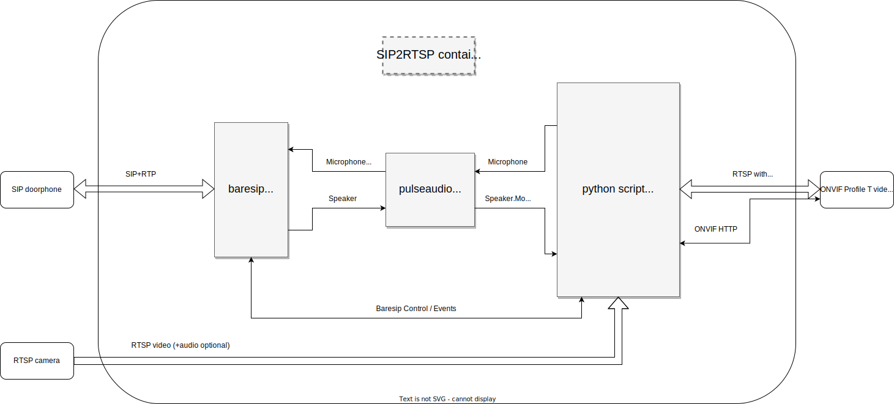

# SIP2RTSP
A docker container that uses [baresip](https://github.com/baresip/baresip), [pulseaudio](https://www.freedesktop.org/wiki/Software/PulseAudio/) and [gstreamer RTSP server](https://gstreamer.freedesktop.org/documentation/gst-rtsp-server/rtsp-onvif-server.html?gi-language=python) to provide a solution that connects to a SIP peer (audio only) and a video camera to present an ONVIF profile T video doorbell with two-way audio support.

Please the following block diagram how this is achieved.

## Block diagram

